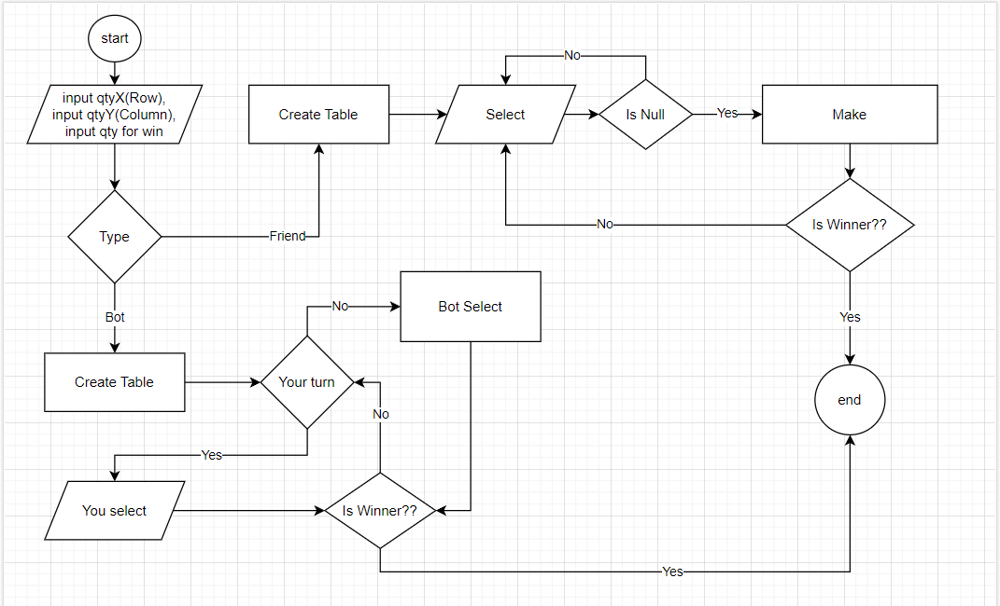
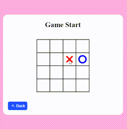
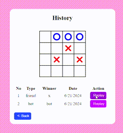
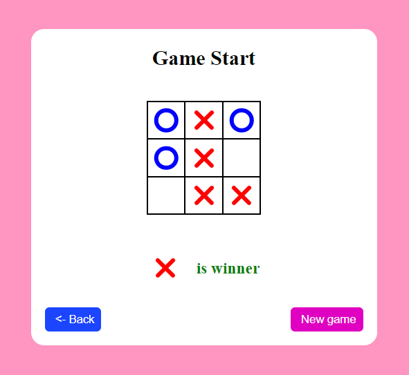
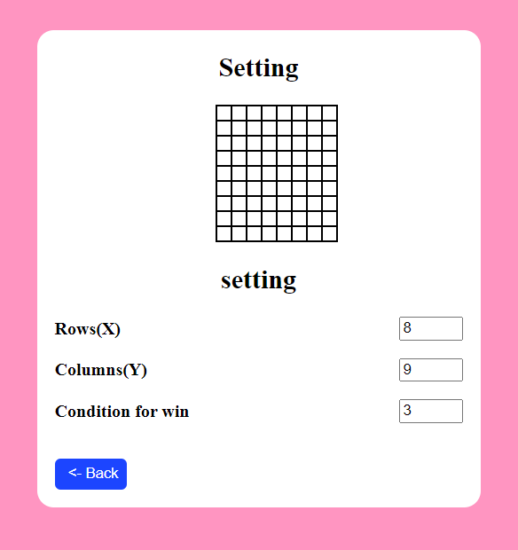
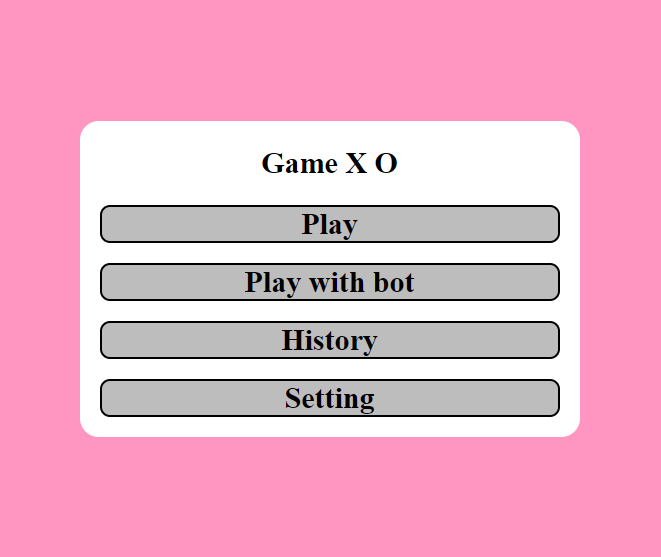

### Game X O custom

## Run first project
- run command --> git clone https://github.com/TaTarZ4/book-shop-laravel.git
- edit file .env set you database
- run command --> php artisan migrate
- run command --> php artisan serve

## algorithm

## result

 

